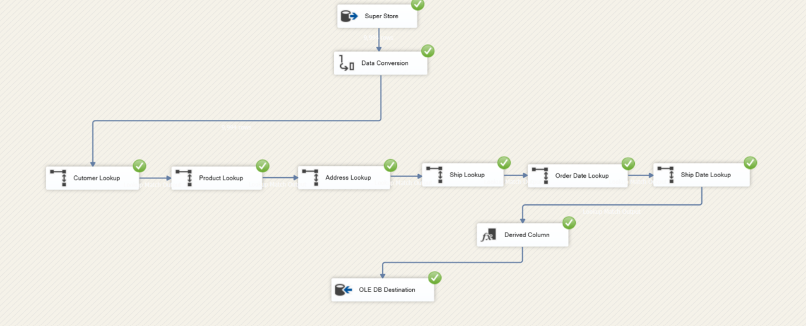
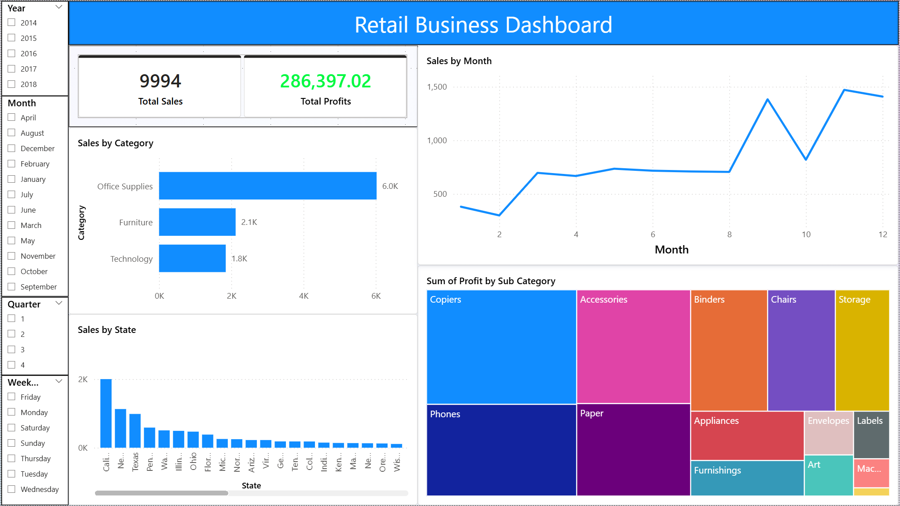
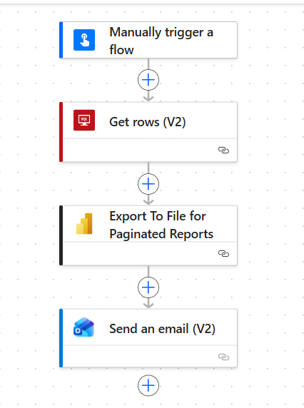

# SSIS ETL Data Warehouse & Power BI Analytics Solution

## 📌 Project Overview

This project demonstrates an end-to-end **ETL and Data Warehouse implementation** using **SQL Server Integration Services (SSIS)**, dimensional modeling (Star Schema), and **Power BI** for interactive analytics and role-based reporting.

The solution extracts data from a staging schema, transforms it using SSIS, loads it into a structured star schema warehouse, and visualizes business KPIs through secure Power BI dashboards.

---

## 🏗 Architecture Overview

The system follows a structured ETL workflow:

1. **Source Layer (DataImport Schema)**
   Raw data is stored in SQL Server staging tables.

2. **ETL Layer (SSIS)**
   SSIS packages extract, transform, and load data into dimensional warehouse tables.

3. **Data Warehouse Layer (Final Schema)**
   Star schema implementation including:
   - Dimension tables
   - FactSales table

4. **Analytics Layer (Power BI)**
   - Interactive KPI dashboards
   - Dynamic DAX-based Role Level Security (RLS)
   - Business performance tracking

---

## 📂 Project Structure

```
SSIS-ETL-Data-Warehouse-PowerBI-Analytics/
│
├── ETL Pipeline/                # Contains SSIS solution and packages
│   ├── ETL Pipeline.sln
│   └── (SSIS project files)
│
├── images/
│   ├── Dashboard.png            # Power BI dashboard screenshot
│   |── pipeline.png             # SSIS pipeline design screenshot
|   |__ Power_Automate_Flow.png  # Power Automate flow
│
├── DataImportSchema.sql         # SQL script to create schemas & dimension tables
├── FactSales.sql                # SQL script to create FactSales table
├── ERP Analytics.pbix           # Power BI report file
├── Sample - Superstore.csv      # Sample dataset
├── us_contacts.csv

```

---

## 🔄 ETL Pipeline (SSIS)

The SSIS package performs:

- Data extraction from `DataImport` schema
- Data cleansing and transformation
- Surrogate key generation
- Lookup transformations for dimensions
- Loading into final star schema tables
- Error handling and logging

### ETL Pipeline Design



---

## 🗄 Data Warehouse Design

The warehouse follows a **Star Schema** model:

### Dimension Tables

- Created via `DataImportSchema.sql`
- Includes structured business entities (Customer, Product, Date, etc.)

### Fact Table

- `FactSales.sql` creates the `FactSales` table
- Contains measurable metrics such as:
  - Sales
  - Quantity
  - Profit
  - Foreign keys to dimension tables

This structure enables optimized analytical queries and BI reporting performance.

---

## 📊 Power BI Dashboard

The Power BI report (`ERP Analytics.pbix`) includes:

- Sales KPIs
- Profitability trends
- Regional performance analysis
- Customer and product insights
- Time-based analysis

Dynamic **Row-Level Security (RLS)** was implemented using DAX to restrict data access based on user roles.

### Dashboard Preview



---

## Reporting Automation

A flow was created to automatically send emails to managers aligned with the Row‑Level Security (RLS) principles established.




## 🔐 Security & Governance

- Implemented dynamic Role-Level Security (RLS) using DAX
- Controlled access to sensitive metrics
- Ensured data integrity during ETL transformations

---

## 🛠 Technologies Used

| Technology | Purpose |
|---|---|
| SQL Server | Database & staging layer |
| SSIS | ETL pipeline orchestration |
| T-SQL | Data transformation logic |
| Star Schema | Dimensional data modeling |
| Power BI | Visualization & dashboards |
| DAX | RLS & calculated measures |
| Git | Version control |

---

## 🚀 Key Highlights

- Built complete ETL pipeline from staging to warehouse
- Designed dimensional model for scalable analytics
- Implemented performance-optimized star schema
- Developed secure, role-based Power BI reporting
- Delivered end-to-end enterprise-style BI solution
